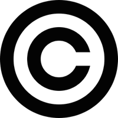

Há informações em abundância que podemos acessar na Internet, porém na
maioria dos casos temos limitações quanto a como podemos utilizar esses
materiais legalmente, ou seja, existem restrições. O desafio está em
parte nas leis que regulamentam direitos do autor. Imagens, vídeos, sons
e páginas que estão acessíveis na Internet são na maioria das vezes
protegidas por direito autoral. Em inglês isso é conhecido como
copyright e pode ser identificado com o símbolo ©. Isto significa que
pode não ser legal baixar, usar ou distribuir ou adaptar tudo o que
achamos na Internet, mesmo que seja uma prática fácil e comum nas
escolas, em casa ou em lan house. No Brasil o que ocorre é que o autor
detém automaticamente os direitos autorais completos sobre suas criações
assim que estas são criadas.

>
>"©" usado para indicar que a obra mantém todos direitos do autor[^1]

Tais direitos podem ser divididos em duas partes: direitos morais e
patrimoniais. No Brasil os direitos autorais patrimoniais são direitos
disponíveis – ou seja podem ser transmitidos a terceiros total ou
parcialmente. Já os direitos morais do autor não podem ser
desconstituídos ou transferidos a terceiros. O conceito e possibilidade
das “licenças” só são plausíveis com o reconhecimento e a garantia do
direito autoral no contexto destas leis.

Sob as leis de direitos autorais cada autor é detentor dos direitos
morais e patrimoniais sobre as obras que criou. Isso deixa de ser
verdade a partir do momento que o autor cede seus direitos, por exemplo:
caso o autor ceda os direitos para uma empresa. Mas mesmo no caso das
licenças, o autor não “perde” seus direitos. Ele(a) só “empresta” seus
direitos por certo tempo. Em ambos os casos, entretanto, o direito
autoral continua nas mãos do autor.

Quando você vê o termo Copyright, ou o símbolo © em uma página na
Internet ou em material impresso, isso significa “todos os direitos
reservados”. Na prática, denota que não podemos usar, adaptar ou
redistribuir estes materiais sem a expressa autorização do autor. Isso
também vale quando não há nenhuma explicação na página. Você deve
assumir que os direitos são restritos, e só será o contrário caso a
página ou o recurso aponte para uma licença livre como do Creative
Commons ou traga um “termo de uso” que explique as condições
permitidas[^2] . Mesmo sem essas indicações, se o autor não expressar
claramente que abre mão de alguns de seus direitos de autor, a lei
brasileira considera o conteúdo fechado. Tudo que é criado por alguém é
automaticamente “reservado”. Ou seja, você detêm “todos os direitos” por
aquele plano de aula que você compartilhou com outro professor, a
atividade que você colocou em um blog, ou qualquer outro trabalho
intelectual que você tenho registrado em alguma mídia. Cabe a você (ao
autor) permitir ou não maior abertura para os recursos que você cria.
Mas lembre-se que quanto mais permissões forem dadas, mais interoperável
será o seu REA e mais oportunidades de colaboração poderão surgir, como
apontamos acima.

>Instituições também podem ter boas razões para encorajar a abertura dos
seus recursos educacionais. Um exemplo é a [Secretaria Municipal de
Educação de São Paulo](http://portalsme.prefeitura.sp.gov.br), que,
desde Junho de 2011 aderiu ao Creative Commons, liberando o uso de
material didático com alguns direitos reservados. As únicas restrições
são que o material não seja usado para fins comerciais e que quaisquer
adaptações dos recursos sejam também compartilhadas sob a mesma licença
do original. A iniciativa é baseada no argumento de que uma vez que o
material é produzido com recursos públicos, faz sentido torná-los
abertos[^3].
Foi aprovado também o Decreto 52.681 que define os termos de
licenciamento obrigatório para obras intelectuais no âmbito da
Secretaria Municipal de Educação do Município de São Paulo. Esse decreto
efetivamente determia que obras criadas ou compradas (por exemplo,
através de editais) no âmbito da Secretaria de Educação, devem ter uma
licença mais permissiva. É um grande exemplo, e existem poucas
iniciativas similares ao redor do mundo[^4].

Para os alunos e para muitos professores é comum entrar na Internet para
baixar imagens, músicas e vídeos, sem qualquer atenção aos direitos de
autor. Parece difícil imaginar que há alguma consequência negativa
quanto a essa prática. Baixar e utilizar uma imagem de um site de
notícias sem a permissão do autor pode parecer inofensivo, mas em alguns
casos, pode expor você e sua instituição a uma situação de possível
infração a direito de terceiros.

Na medida em que começamos a fazer parte do espaço virtual, temos que
prestar maior atenção à estas questões. Muitos professores compartilham
recursos em sites colaborativos como YouTube ou blogs. Se você planeja
compartilhar REA com outras pessoas, muitos sites como Flickr e YouTube
poderão excluir o material da rede caso recebam reclamações de terceiros
que afirmem que você utilizou a obra sem a autorização do autor ou
detentor de direitos autorais. Isso pode acontecer:

* se você tiver feito uso da obra ou
* parte dela para compor uma obra sua ou
* simplesmente quando você publica algo na Internet sem a autorização dos autores ou
detentores dos direitos.

Partindo deste princípio é importante que
alunos (cada vez mais “produtores” de conteúdo) entendam o papel do
direito autoral e os direitos que todos nós possuímos dentro das
chamadas exceções e limitações aos direitos autorais. Estas permitem por
exemplo que citemos obras, as utilizemos para fins jornalísticos ou
mesmo para desenvolver paródias.

[^1]: Imagem retirada de
    <http://commons.wikimedia.org/wiki/File:Copyright.svg>

[^2]: O Livro Didático Público é tal exemplo. Ele não faz uso da licença
    Creative Commons mas explicita que: "É permitida a reprodução total
    ou parcial desta obra, desde que citada a fonte."

[^3]: Baseado em
    <http://www.prefeitura.sp.gov.br/portal/a_cidade/noticias/index.php?p=44748>

[^4]: Saiba mais em <http://rea.net.br/>
